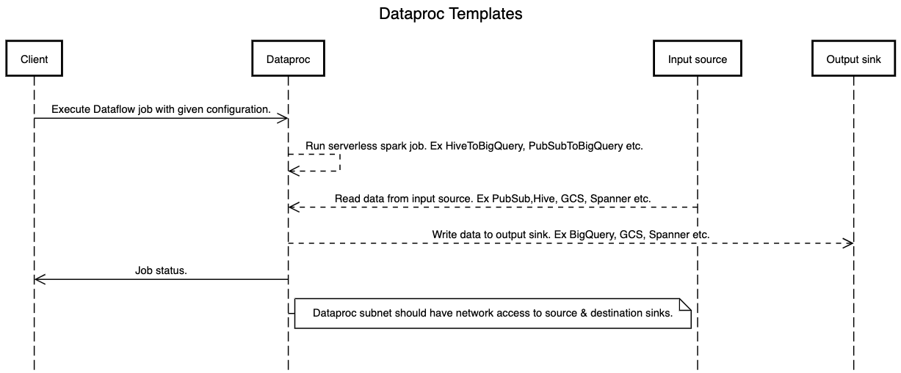

# Dataproc Templates
Dataproc templates are designed to address various in-cloud data tasks, including data import/export/backup/restore and bulk API operations. These templates leverage the power of [Google Cloud's Dataproc](https://cloud.google.com/dataproc/), supporting both Dataproc Serverless and Dataproc clusters.

Google provides this collection of pre-implemented Dataproc templates as a reference and for easy customization. (Video [Link](https://www.youtube.com/watch?v=ZQIaY0pNlmI))

## Dataproc Templates (Java - Spark)
Please refer to the [Dataproc Templates (Java - Spark) README](/java) for more information

* [BigQueryToGCS](java/src/main/java/com/google/cloud/dataproc/templates/bigquery#BigQuery-To-GCS)
* [CassandraToBigQuery](java/src/main/java/com/google/cloud/dataproc/templates/databases#executing-cassandra-to-bigquery-template)
* [CassandraToGCS](java/src/main/java/com/google/cloud/dataproc/templates/databases#executing-cassandra-to-gcs-template) (blogpost [link](https://medium.com/google-cloud/migrate-data-from-cassandra-to-gcs-using-java-and-dataproc-serverless-5358ef498f6b))
* [DataplexGCStoBQ](/java/src/main//java/com/google/cloud/dataproc/templates/dataplex#dataplex-gcs-to-bigquery)(blogpost [link](https://medium.com/google-cloud/using-dataproc-serverless-to-migrate-your-dataplex-gcs-data-to-bigquery-1e47bc8de74c))
* [GCSToBigQuery](/java/src/main/java/com/google/cloud/dataproc/templates/gcs#1-gcs-to-bigquery) (blogpost [link](https://medium.com/google-cloud/importing-data-from-gcs-to-bigquery-via-spark-bq-connector-using-dataproc-serverless-25e29f84888d))
* [GCSToBigTable](/java/src/main/java/com/google/cloud/dataproc/templates/gcs#1-gcs-to-bigquery) (blogpost [link](https://medium.com/google-cloud/load-data-from-gcs-to-bigtable-using-gcp-dataproc-serverless-5c43d773e615)) (Video [link](https://www.youtube.com/watch?v=JwO72i2nVPU))
* [GCSToGCS](/java/src/main/java/com/google/cloud/dataproc/templates/gcs#4-gcs-to-gcs) (blogpost [link](https://medium.com/@ankuljain/migrate-gcs-to-gcs-using-dataproc-serverless-3b7b0f6ad6b9))
* [GCSToJDBC](/java/src/main/java/com/google/cloud/dataproc/templates/gcs#3-gcs-to-jdbc) (blogpost [link](https://medium.com/google-cloud/importing-data-from-gcs-to-databases-via-jdbc-using-dataproc-serverless-7ed75eab93ba))
* [GCSToMongo](/java/src/main/java/com/google/cloud/dataproc/templates/gcs#6-gcs-to-mongo)
* [GCSToSpanner](/java/src/main/java/com/google/cloud/dataproc/templates/gcs#2-gcs-to-spanner) (blogpost [link](https://medium.com/google-cloud/fast-export-large-database-tables-using-gcp-serverless-dataproc-spark-bb32b1260268))
* [GeneralTemplate](/java/src/main/java/com/google/cloud/dataproc/templates/general)
* [HBaseToGCS](/java/src/main/java/com/google/cloud/dataproc/templates/hbase#1-hbase-to-gcs)(blogpost [link](https://medium.com/google-cloud/using-dataproc-serverless-to-migrate-your-hbase-data-to-gcs-bf1ccf4ab945))
* [HiveToBigQuery](/java/src/main/java/com/google/cloud/dataproc/templates/hive#1-hive-to-bigquery)(blogpost [link](https://medium.com/google-cloud/using-dataproc-serverless-to-migrate-your-hive-data-to-bigquery-8e2d4fcd1c24))
* [HiveToGCS](/java/src/main/java/com/google/cloud/dataproc/templates/hive#2-hive-to-gcs) (blogpost [link](https://medium.com/@nehamodgil_21070/processing-and-migrating-large-data-tables-from-hive-to-gcs-using-java-and-dataproc-serverless-b6dbbae61c5d))
* [JDBCToBigQuery](/java/src/main/java/com/google/cloud/dataproc/templates/jdbc#1-jdbc-to-bigquery) (blogpost [link](https://medium.com/@sjlva/java-fast-export-large-database-tables-using-gcp-serverless-dataproc-fe6ffffe28b5))
* [JDBCToGCS](/java/src/main/java/com/google/cloud/dataproc/templates/jdbc#2-jdbc-to-gcs) (blogpost [link](https://medium.com/google-cloud/fast-export-large-database-tables-using-gcp-serverless-dataproc-spark-bb32b1260268))
* [JDBCToJDBC](/java/src/main/java/com/google/cloud/dataproc/templates/jdbc#3-jdbc-to-jdbc)
* [JDBCToSpanner](/java/src/main/java/com/google/cloud/dataproc/templates/jdbc#4-jdbc-to-spanner)
* [KafkaToBQ](/java/src/main/java/com/google/cloud/dataproc/templates/kafka#1-kafka-to-bigquery) (blogpost [link](https://medium.com/google-cloud/export-data-from-apache-kafka-to-bigquery-using-dataproc-serverless-4a666535117c))
* [KafkaToBQDstream](/java/src/main/java/com/google/cloud/dataproc/templates/kafka#4-kafka-to-bq-via-spark-direct-stream)
* [KafkaToGCS](/java/src/main/java/com/google/cloud/dataproc/templates/kafka/README.md#2-kafka-to-gcs) (blogpost [link](https://medium.com/@pniralakeri/importing-data-from-kafka-to-gcs-using-dataproc-serverless-38e449d559f9))
* [KafkaToGCSDstream](/java/src/main/java/com/google/cloud/dataproc/templates/kafka#5-kafka-to-gcs-via-spark-direct-stream)
* [KafkaToPubSub](/java/src/main/java/com/google/cloud/dataproc/templates/kafka/README.md#3-kafka-to-pubsub)
* [MongoToGCS](/java/src/main/java/com/google/cloud/dataproc/templates/databases#executing-mongo-to-gcs-template) (blogpost [link](https://medium.com/google-cloud/migrating-data-from-mongo-to-gcs-using-java-and-dataproc-serverless-template-390500481804))
* [PubSubToBigQuery](/java/src/main/java/com/google/cloud/dataproc/templates/pubsub#1-pubsub-to-bigquery) (blogpost [link](https://medium.com/google-cloud/from-pub-sub-to-bigquery-streaming-data-in-near-real-time-b550aeff595d))
* [PubSubToBigTable](/java/src/main/java/com/google/cloud/dataproc/templates/pubsub#1-pubsub-to-bigtable) (blogpost [link](https://medium.com/google-cloud/stream-data-from-pub-sub-to-bigtable-using-dataproc-serverless-3142c1bcc22a))
* [PubSubLiteToBigTable](/java/src/main/java/com/google/cloud/dataproc/templates/pubsublite#1-pubsublite-to-bigtable) (blogpost [link](https://medium.com/google-cloud/stream-data-from-pub-sub-lite-to-bigtable-using-dataproc-serverless-2c8816f40581))
* [PubSubToGCS](/java/src/main/java/com/google/cloud/dataproc/templates/pubsub#2-pubsub-to-gcs) (blogpost [link](https://medium.com/google-cloud/stream-data-from-pub-sub-to-cloud-storage-using-dataproc-serverless-7a1e4823926e))
* [RedshiftToGCS](/java/src/main/java/com/google/cloud/dataproc/templates/databases#executing-redshift-to-gcs-template) (blogpost [Link](https://medium.com/google-cloud/exporting-data-from-redshift-to-gcs-using-gcp-dataproc-serverless-java-5b82044d78e7))
* [S3ToBigQuery](/java/src/main/java/com/google/cloud/dataproc/templates/s3#1-s3-to-bigquery) (blogpost [link](https://medium.com/google-cloud/export-data-from-aws-s3-to-bigquery-using-dataproc-serverless-6dc7a9952fc4))
* [SnowflakeToGCS](/java/src/main/java/com/google/cloud/dataproc/templates/snowflake#1-snowflake-to-gcs) (blogpost [link](https://medium.com/google-cloud/export-snowflake-query-results-to-gcs-using-dataproc-serverless-3d68f5a01ca9))
* [SpannerToGCS](/java/src/main/java/com/google/cloud/dataproc/templates/databases#executing-spanner-to-gcs-template) (blogpost [link](https://medium.com/google-cloud/cloud-spanner-export-query-results-using-dataproc-serverless-6f2f65b583a4))
* [TextToBigquery](/java/src/main/java/com/google/cloud/dataproc/templates/gcs#7-text-to-bigquery)
* [WordCount](/java/src/main/java/com/google/cloud/dataproc/templates/word/WordCount.java)

## Dataproc Templates (Python - PySpark)
Please refer to the [Dataproc Templates (Python - PySpark) README](/python) for more information
* [AzureBlobToBigQuery](/python/dataproc_templates/azure#azure-blob-to-bigquery)
* [BigQueryToGCS](/python/dataproc_templates/bigquery#bigquery-to-gcs) (blogpost [link](https://medium.com/google-cloud/moving-data-from-bigquery-to-gcs-using-gcp-dataproc-serverless-and-pyspark-f6481b86bcd1))
* [CassandraToBigquery](/python/dataproc_templates/cassandra)
* [CassandraToGCS](/python/dataproc_templates/cassandra) (blogpost [link](https://medium.com/google-cloud/export-data-from-cassandra-to-google-cloud-storage-using-dataproc-serverless-2569a00e17fe))
* [ElasticsearchToBigQuery](/python/dataproc_templates/elasticsearch#elasticsearch-to-bq)
* [ElasticsearchToBigtable](/python/dataproc_templates/elasticsearch#elasticsearch-to-bigtable)
* [ElasticsearchToGCS](/python/dataproc_templates/elasticsearch#elasticsearch-to-gcs)
* [GCSToBigQuery](/python/dataproc_templates/gcs#gcs-to-bigquery) (blogpost [link](https://medium.com/@ppaglilla/getting-started-with-dataproc-serverless-pyspark-templates-e32278a6a06e))
* [GCSToBigTable](/python/dataproc_templates/gcs#gcs-to-bigtable)(blogpost [link](https://medium.com/google-cloud/pyspark-load-data-from-gcs-to-bigtable-using-gcp-dataproc-serverless-c373430fe157))
* [GCSToGCS](/python/dataproc_templates/gcs#gcs-to-gcs---sql-transformation) (blogpost [link](https://medium.com/@ankuljain/migrate-gcs-to-gcs-using-dataproc-serverless-3b7b0f6ad6b9))
* [GCSToJDBC](/python/dataproc_templates/gcs#gcs-to-jdbc) (blogpost [link](https://medium.com/google-cloud/import-data-from-gcs-to-jdbc-databases-using-dataproc-serverless-c7154b242430))
* [GCSToMongo](/python/dataproc_templates/gcs#gcs-to-mongodb) (blogpost [link](https://medium.com/google-cloud/importing-data-from-gcs-to-mongodb-using-dataproc-serverless-fed58904633a))
* [HbaseToGCS](/python/dataproc_templates/hbase#hbase-to-gcs) (blogpost [link](https://medium.com/@nehamodgil_21070/dataproc-serverless-for-exporting-large-data-files-from-hbase-to-gcs-d89057279512))
* [HiveToBigQuery](/python/dataproc_templates/hive#hive-to-bigquery) (blogpost [link](https://medium.com/google-cloud/processing-data-from-hive-to-bigquery-using-pyspark-and-dataproc-serverless-217c7cb9e4f8))
* [HiveToGCS](/python/dataproc_templates/hive#hive-to-gcs) (blogpost [link](https://medium.com/@surjitsh/processing-large-data-tables-from-hive-to-gcs-using-pyspark-and-dataproc-serverless-35d3d16daaf))
* [JDBCToBigQuery](/python/dataproc_templates/jdbc#3-jdbc-to-bigquery) (blogpost [link](https://medium.com/@sjlva/python-fast-export-large-database-tables-using-gcp-serverless-dataproc-bfe77a132485))
* [JDBCToGCS](/python/dataproc_templates/jdbc#2-jdbc-to-gcs) (blogpost [link](https://medium.com/google-cloud/importing-data-from-databases-into-gcs-via-jdbc-using-dataproc-serverless-f330cb0160f0))
* [JDBCToJDBC](/python/dataproc_templates/jdbc#1-jdbc-to-jdbc) (blogpost [link](https://medium.com/google-cloud/migrating-data-from-one-databases-into-another-via-jdbc-using-dataproc-serverless-c5336c409b18))
* [KafkaToGCS](/python/dataproc_templates/kafka/#kafka-to-gcs) (Blogpost [link](https://medium.com/google-cloud/kafka-to-gcs-using-dataproc-serverless-python-template-750ed218a5cc))
* [KafkaToBigQuery](/python/dataproc_templates/kafka/#kafka-to-bq) (Blogpost [link](https://medium.com/google-cloud/dataproc-serverless-template-to-migrate-your-data-from-kafka-to-bigquery-9b635a66b9dc))
* [MongoToBigQuery](/python/dataproc_templates/mongo#mongot-to-bq)
* [MongoToGCS](/python/dataproc_templates/mongo#mongo-to-gcs) (blogpost [link](https://medium.com/google-cloud/exporting-data-from-mongodb-to-gcs-buckets-using-dataproc-serverless-64830fb15b51))
* [PubSubLiteToBigtable](/python/dataproc_templates/pubsublite#pubsublite-to-bigtable)
* [RedshiftToGCS](/python/dataproc_templates/redshift#redshift-to-gcs) (blogpost [link](https://medium.com/google-cloud/exporting-data-from-redshift-to-gcs-using-gcp-dataproc-serverless-and-pyspark-9ab78de11405))
* [S3ToBigQuery](/python/dataproc_templates/s3#amazon-s3-to-bigquery)
* [SnowflakeToGCS](/python/dataproc_templates/snowflake#1-snowflake-to-gcs) (blogpost [link](https://medium.com/@varunikagupta96/exporting-data-from-snowflake-to-gcs-using-pyspark-on-dataproc-serverless-363d3bed551b))
* [TextToBigQuery](/python/dataproc_templates/gcs#text-to-bigquery) (blogpost [link](https://medium.com/google-cloud/dataproc-serverless-pyspark-template-for-ingesting-compressed-text-files-to-bigquery-c6eab8fb6bc9))

## Dataproc Templates (Notebooks)
Please refer to the [Dataproc Templates (Notebooks) README](/notebooks) for more information

* [HiveToBigQuery](/notebooks/hive2bq#dataproc-template-to-migrate-hive-tables-to-bigquery-using-jupyter-notebooks) (blogpost [link](https://medium.com/google-cloud/hive-to-bigquery-move-data-efficiently-using-gcp-dataproc-serverless-ee30d35aaf03))
* [MsSqlToBigQuery](/notebooks/mssql2bq#jupyter-notebook-solution-for-migrating-mssql-sql-server-to-bigquery-dwh-using-dataproc-templates)(blogpost [link](https://medium.com/google-cloud/mssql-to-bigquery-migrate-efficiently-using-vertex-ai-notebook-and-gcp-dataproc-serverless-98358943568a))
* [MySQLToSpanner](/notebooks/mysql2spanner#jupyter-notebook-solution-for-migrating-mysql-database-to-cloud-spanner-using-dataproc-templates) (blogpost [link](https://medium.com/google-cloud/mysql-to-cloud-spanner-migrate-mysql-database-to-cloud-spanner-using-vertex-ai-notebooks-and-gcp-ad7d2ed8a317))
* [SQLServerToPostgres](/notebooks/mssql2postgresql#jupyter-notebook-solution-for-migrating-mssql-sql-server-to-postgres-database-using-dataproc-templates)
* [OracleToBigQuery](/notebooks/oracle2bq#jupyter-notebook-solution-for-migrating-oracle-database-to-bigquery-using-dataproc-templates)(blogpost [link](https://medium.com/@neerajshivhare/oracle-to-bigquery-migrate-oracle-to-bigquery-using-vertex-ai-notebooks-and-gcp-dataproc-9d22b73968c3))
* [OracleToPostgres](/notebooks/oracle2postgres#jupyter-notebook-solution-for-migrating-oracle-database-to-postgres-using-dataproc-templates)(blogpost [Link](https://medium.com/google-cloud/oracle-to-postgresql-migrate-oracle-to-postgresql-using-vertex-ai-notebooks-and-gcp-dataproc-9924f3f5c51f))
* [OracleToSpanner](/notebooks/oracle2spanner#jupyter-notebook-solution-for-migrating-oracle-database-to-cloud-spanner-using-dataproc-templates) (blogpost [Link](https://medium.com/@surjitsh/oracle-to-cloud-spanner-migrate-oracle-database-to-cloud-spanner-using-vertex-ai-notebooks-and-gcp-49152ce7f4e8))

## Getting Started

1) Clone this repository

        git clone https://github.com/GoogleCloudPlatform/dataproc-templates.git
2) Obtain authentication credentials

   Create local credentials by running the following command and following the
   oauth2 flow (read more about the command [here](https://cloud.google.com/sdk/gcloud/reference/auth/application-default/login).

        gcloud auth application-default login

   Or manually set the `GOOGLE_APPLICATION_CREDENTIALS` environment variable
   to point to a service account key JSON file path.

   Learn more at [Setting Up Authentication for Server to Server Production Applications](https://developers.google.com/identity/protocols/oauth2/service-account).

*Note:* Application Default Credentials is able to implicitly find the credentials as long as the application is running on Compute Engine, Kubernetes Engine, App Engine, or Cloud Functions.

3) Executing a Template

    Follow the specific guide, depending on your use case:
   - [Dataproc Templates (Java - Spark)](java)
   - [Dataproc Templates (Python - PySpark)](python)

## Flow diagram

Below flow diagram shows execution flow for Dataproc Templates:

## Contributing
See the contributing [instructions](/CONTRIBUTING.md) to get started contributing.

## License
All solutions within this repository are provided under the [Apache 2.0](https://www.apache.org/licenses/LICENSE-2.0) license. Please see the [LICENSE](/LICENSE) file for more detailed terms and conditions.

## Disclaimer
This repository and its contents are not an official Google Product.

## Contact
Share your feedback, ideas, thoughts [feedback-form](https://forms.gle/XXCJeWeCJJ9fNLQS6)

Questions, issues, and comments should be directed to dataproc-templates-support-external@googlegroups.com

[gcf]: https://cloud.google.com/functions/
[gcf-bg]: https://cloud.google.com/functions/docs/writing/background
[logs-export]: https://cloud.google.com/logging/docs/export/
