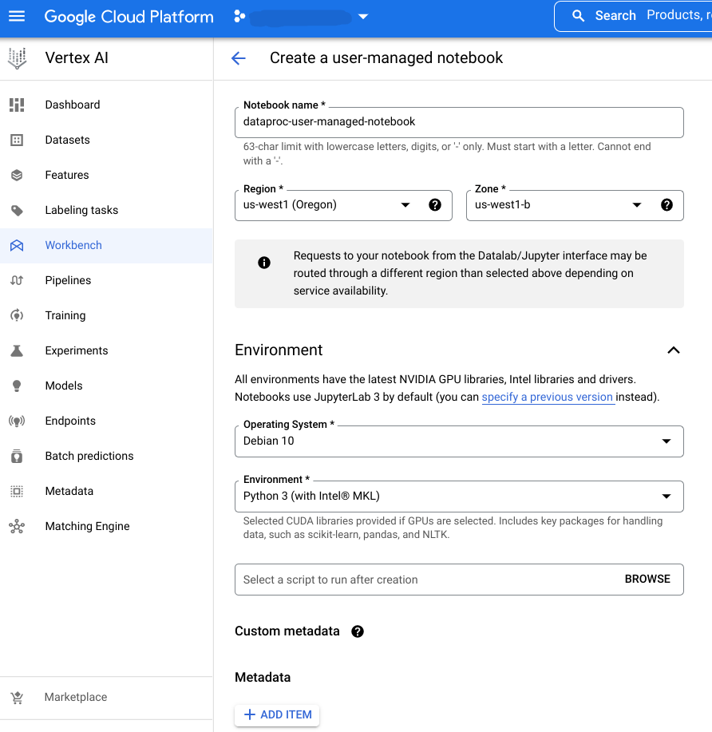

# Dataproc Templates (Jupyter Notebooks)

* [Vertex AI Pipelines - PySpark](./vertex_pipeline_pyspark.ipynb)

Notebooks in this folder demonstrate how to run **Dataproc Templates** from Jupyter Notebooks using Vertex AI. 

### Overview

Recently, Google made Serverless Spark even more powerful, by enabling serverless interactive development through [Dataproc Sessions](https://cloud.google.com/blog/products/data-analytics/making-serverless-spark-even-more-powerful) in Jupyter notebooks, natively integrated with [Vertex AI Workbench](https://cloud.google.com/vertex-ai-workbench).  

Additionally, a data scientist can automate a Dataproc Template execution with [Vertex AI Pipelines](https://cloud.google.com/vertex-ai/docs/pipelines/introduction) and [Serverless Spark Kubeflow components](https://cloud.google.com/blog/topics/developers-practitioners/announcing-serverless-spark-components-vertex-ai-pipelines).  

### Deploying Dataproc Templates to Vertex AI

The best way to get started is to clone the Dataproc Templates repository to your Jupyter environment in Vertex AI, and run the notebook.  

1) Enable Vertex AI API and Notebooks API in your GCP project
2) Create a [User-Managed](https://cloud.google.com/vertex-ai/docs/workbench/user-managed/introduction) or [Managed](https://cloud.google.com/vertex-ai/docs/workbench/managed/introduction) Notebook in Vertex AI Workbench

   

   Dataproc Sessions is only available on a Managed Notebook, but Dataproc Kubeflow component can be run using a User-Managed Notebook.  
   
   In this example, a User-Managed notebook is created using the Compute Engine default service account.

3) Open the created notebook, clone the [Dataproc Templates](https://github.com/GoogleCloudPlatform/dataproc-templates) GitHub repository and run the desired notebook located in the *python/notebooks* folder

   